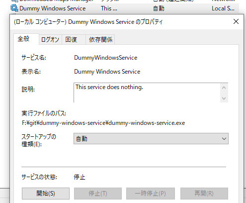

# dummy-windows-service

It is a Windows service that does nothing.  
Used to confirm service start and stop operations.

## Usage

You can download the executable file from the following link.

* https://github.com/onozaty/dummy-windows-service/releases/latest

The `-service` option allows you to perform operations on the service.

The service name is `DummyWindowsService`.



### Install

```
dummy-windows-service.exe -service install
```

### Start

```
dummy-windows-service.exe -service start
```

### Stop

```
dummy-windows-service.exe -service stop
```

### Uninstall

```
dummy-windows-service.exe -service uninstall
```
